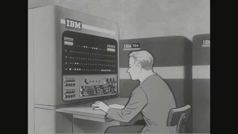

    Hello, I'm Don - aka Bozer/Boombozer.

    I'm a 17 years old, Who's doesn't like to eat a cream part of oreo.

    

- 🌱 I’m currently learning about Reverse Engineer on C/C++.
- 🎩 I really like to learn about Malware, Denial of Service and Coding.
- 👾 I write Go mostly, But also know another language like C/C++ and Java too.
- 🧢 I’m looking to join some University with IT, CS or SE Major.
- 😞 Fact: I'm not really good at web development.

